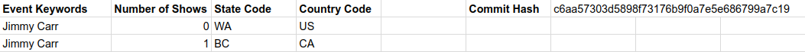

# Ticketmaster Notification

This is a google script that fetches data from Ticketmaster using their public
API, and will send you an email when a new event is added to Ticketmaster that
matches an event name and location that you specify. The reason for this script
is because I found the default Ticketmaster notifications less useful since you
can only get notifications about events within a certain range of one place.
With this script, you can specify the entire Province/State (or whatever your
country calls them) for alerts. For me personally living close to the USA
border, I would like to know about events that are taking place in Washington,
and BC.

## Initial Setup

This will be a step by step guide to start using the script:

Open you Google Drive, and create a new Google Script file by clicking `New ->
more -> Google Apps Script`. Call it whatever you want, and just copy the
contents of `ticketmaster_script.gs` to this new file. You can bury it in any
folder you want, it doesn't care where it goes.

In your Google Drive, create a new spreadsheet and call it whatever you want.
We will use this spreadsheet to start adding events to track. The following
screenshot shows the general format of the spreadsheet:



Please make sure to put the bolded headings in, or at least leave those cells
blank. Those cells are not parsed in any way by the script.

As a start, you put the event name you are looking for under the
`Event Keywords` column. These are keywords, thus, the event name does not need
to be the exact name you provide. You will also need to provide The State and
Country Codes under their respective columns. Leave EVERYTHING else blank, as
they are filled automatically by the script after execution.

More information on the columns will be in the below section.

### Overview of the Columns

#### Column A

Column `A` is the `Event Keywords` column. It is used for you to specify a
keyword to use to find events.

#### Column B

This is the `Number of Shows` column. It is automatically populated by the
script so do not ever touch this column. This column displays the number of
events that match that keyword that the script currently knows about that are
happening in the future. Once the event happens, this cell is updated to reflect
that.

If you would like to force the script to send you the notifications for an event
again, you can easily do this by setting this cell to a `0` or empty which will
force the script to send you the events again by email.

#### Column C and D

These columns are the `State Code` and `Country Code` columns respectively. It
is your responsibility to fill these in. If you want to search for the same
event in multiple locations, you must make multiple rows with the same keyword
that have different state and country codes (as shown in the screenshot in the
`Initial Setup` section).

Country codes are
[ISO Alpha-2 Codes](https://en.wikipedia.org/wiki/ISO_3166-1#Officially_assigned_code_elements)
(Make sure to check the `Alpha-2 code` column in the chart).

I am not sure how the State Codes are determined for the script. I do know that
for Canada and the USA it is the 2 character abbreviations that we have for our
Provinces/States.

**Please note that at this time the script does require both a
State and Country Code. If there is a request to make that optional I will look
into doing that.**

#### Cell G1 - Commit Hash

This is for the script to keep track of the current version of the script. If
that value doesn't agree with what Github says is the newest hash then an email
is sent to you saying that your script is out of date.

This feature is off by default. See the `Configuration Variables` section of the
README for details on the `auto_update_check`, `branch_to_check_for_updates`,
and `github_api_token` configuration variables to enable the feature.

### Continuing with Instructions

Now open the script from the first step. There is a line at the top of the file
like this:

```javascript
var spreadsheet_id = ""
```

Fill the inside of the quotes with the id of the spreadsheet you made in the
previous step. The id is found in the URL of the spreadsheet. If the spreadsheet
has this URL for example:

```
docs.google.com/spreadsheets/d/1RSklW9SKI535TG0LnH9cjU2c3spLtnbPBAKWahUWO7I/edit#gid=0
```

Then `1RSklW9SKI535TG0LnH9cjU2c3spLtnbPBAKWahUWO7I` is your id, so the
`spreadsheet_id` variable changes to this:

```javascript
var spreadsheet_id = "1RSklW9SKI535TG0LnH9cjU2c3spLtnbPBAKWahUWO7I"
```

You will also need a Ticketmaster API token.

To get this API Token:

1. Visit the
[API Website](https://developer-acct.ticketmaster.com/user/login)
2. Create an account (NOTE that this is NOT a Ticketmaster account. An API
   account is different). If you already have an account then just login and
   skip to step `8`
3. Provide the form with the required information (for company name and URL just
   say something like `none`)
4. Open the automated email you received and visit the link it provided.
5. You will be prompted to login. Click the button.
6. Now you set your password. You can set other settings there if you want, but
   the password is the only necessary thing.
7. Make sure the `Agree to the terms and conditions` box is checked and click
   `save`.
8. Click your username in the top right corner of the page.
9. Click `My Apps` from the drop down.
10. You should see 1 app already there by default. Click on it.
11. The consumer key that has been listed is your Ticketmaster API Token.
12. Copy that token and paste it between the quotes of the variable. For
    example, if your token is `123456` then it would be `var
    ticketmaster_api_token = "123456"`

Now make sure that the script is saved. And run the script by pressing `Run ->
run`. Google will ask you about some permissions such as asking if it is okay
for the script to use spreadsheets and stuff like that. You have to say yes or
the script won't run. If you added something to your sheet earlier, we should
now see that column `B` has updated in some way.

Finally, while still inside the script, at the top of the screen click:
`Resources -> Current Project's Triggers`. Now click the blue text that says `No
triggers set up. Click here to add one now`.

For the drop down menu under "Run" make sure you select "run". This runs the
`run` function inside the script. For events, you can select any type of trigger
you want. This will determine how often the script is run automatically.

From there, there is also a `notifications` button. If you set this up, the
script will email you if it fails for some reason. I would recommend setting
this.

Now we are done. You will never need to go back to the script unless you are
updating it. If you want to ever add or delete a show from being searched for,
just edit the spreadsheet file.

## Updating Your Script

If you want to get a newer version of this script remove all the code from the
current script you have, while saving the variables at the top of the code such
as your spreadsheet id.

Copy all of the new code into your current script (which is now empty) and
replace the variables at the top with your settings.

Check to see if the new code has a new variable at the top of the code. If you
are unsure of what a variable is for or the possible options you can give, then
see below in the section "Configuration Variables".

Once you have filled in the variables, save the file and do a manual run. This
will check to see if the script now requires new permissions for newly added
features. In order to continue accept the new requirements.


## Configuration Variables

All variables must contain a value of some kind.


### var spreadsheet_id (REQUIRED)

This is a string that comes from the URL of the spreadsheet you will use to
store your TV shows. For example, if your spreadsheet has the URL
`https://docs.google.com/spreadsheets/d/1RSklW9SKI535TG0LnH9cjU2c3spLtnbPBAKWahUWO7I/edit#gid=0`,
then your `spreadsheet_id` is `"1RSklW9SKI535TG0LnH9cjU2c3spLtnbPBAKWahUWO7I"`,
with the quotes included.

This is essential in order to get the script to work.


### var ticketmaster_api_token (REQUIRED)

This is the token that we created earlier. If you missed that part then please
read in the setup section in full. All the detail about this variable is there
and how to get it.

This is essential in order to get the script to work.


### var debug (OPTIONAL)

This variable tells the script if you want to get emailed log reports.

#### Default

The default setting is `false`.

#### Possible Values:

`var debug = true` means that you want to get emails with the logs for
every execution of the script.

`var debug = false` means that you do NOT want to get emails with the logs
at all.


### var auto_update_check (OPTIONAL)

This variable tells the script if you want the update function to run
automatically when you run your script. When the update script is run you will
get a email if an update has happened since the last time the script ran. You
will not receive an email at any other time.

Note that this will **NOT** update the script. It will just warn you of updates
that have occurred.

#### Default

The default setting is `false`.

#### Possible Values:

`var auto_update_check = true` Means to check for updates automatically before
looking for TV Shows.

`var auto_update_check = false` Means that the script will never automatically
check for updates for you. So you will need to manually run the
`check_for_updates` function in order to get updates.


### var branch_to_check_for_updates (REQUIRED if auto_update_check is true)

NOTE: This variable has NO effect if `auto_update_check` is set to `false`

This variable tells the script what branch to check for updates. It will use
this to see if any new commits have come in since the last time the update
function was run.

#### Default

The default setting is `"master"` since that is the most stable branch

#### Possible Values:

`var branch_to_check_for_updates = "master"`

Or an other branch name that exists in the repo.


### var github_api_token (OPTIONAL)

NOTE: This variable has NO effect if `auto_update_check` is set to `false`

Even if you set `auto_update_check` to `true`, this variable does NOT need to be
set. The Github API does not require an API token, but if you don't have one you
will be limited with how much you can use the API in a day.

This variable holds the value of your Github API Token which will ONLY be used
for the purpose of checking for updates. The Github API does not require a
token, but you will be subject to rate limiting if you don't. As a result, if
you do not provide a token to this script, you may find that you get errors in
your script because the API didn't return anything. That being said, it is up to
you whether or not you want to provide a token. The script will work whether you
provide a token or leave the string empty.

#### How to Get a Token?

First, you need a Github Account. If you do not have one, then register for one.
Once you have an account:

1. Login
2. Click your profile picture in the top right corner of the page
3. Select `Settings` from the drop down
4. In the left pane select `Developer Settings`
5. In the left pane select `Personal Access Tokens`
6. Click `Generate new token`
7. Give a description for the token.
8. Below that are scopes. We do NOT need any of them, so leave them all
   unchecked and click `Generate Token`

The next page shows the token. Use this as your token. Note that you will never
be able to see that token again, so copy it there and put it into the script
right away. If you lose the token somehow that is not big deal. Just generate a
new one with the above steps and delete your old token.

#### Default

The default setting is `""` which means that NO token will be used

#### Possible Values:

`var branch_to_check_for_updates = ""`

If `123456` is your token:

`var branch_to_check_for_updates = "123456"`


## Questions

### What if I Accidentally mess with the data in the sheet?

Changing the "A" column is perfectly okay, since this is the column you will use
to tell the script what events to look for. You can freely add and delete events
from this column as you choose (Deleting an event consists of just
deleting that whole row).

Changing the State and Country Code Columns is also okay since you are allowed
to change those as you see fit.

If you plan to just change one of these columns and leave it that way, I would
also suggest emptying column B so that the script knows that you have changed
the row.

If you change data in any of the other columns and if it isn't too late to undo
what you just did, then do that.

Otherwise you can just make the changed cells blank. A blank cell is interpreted
as an undefined value and the script will create a starting value, as if it was
the first time it was populating that cell.

## Thanks To

* Ticketmaster for their website and API
